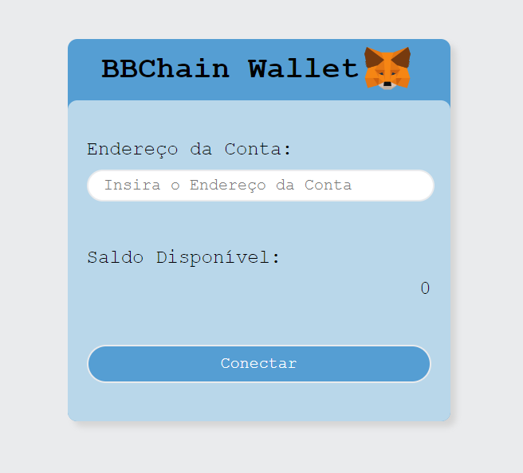

# BBChain Wallet

## Sobre o Projeto

O BBChen Wallet é um projeto simples que visa mostrar a integração entre a MetaMask Wallet com uma interface visual criada em ReactJS. Com a interface é possível tentar buscar seu saldo do MetaMask informando o edereço da conta, caso a extensão do MetaMask não esteja instalada no seu computador, um aviso é mostrado, e é exibido um link que o redireciona para o site da MetaMask. Se a tentativa de conexão ocorrer com sucesso, é retornado uma mensagem de sucesso e o saldo da carteira pe informado.

<p align="center">
   
</p>

### Tecnologias

* [React](https://pt-br.reactjs.org/): para criação da uma inteface simples;
* [Web3JS](https://docs.web3js.org/): para conexão em a MetaMask Wallet;
* [React-toastify](https://fkhadra.github.io/react-toastify/introduction): para avisos visuais para o usuário.

### Instalação Front-End

Clone o repositório deste projeto:

```bash
#Clone o repositório:
$ git clone https://github.com/doug-22/bbchain-wallet.git

#Entre na pasta bbchain-wallet:
$ cd bbchain-wallet

#Instale as denpendencias:
$ yarn
ou
$ npm

#Inicie a aplicação com:
$ yarn start
ou
$ npm run start
```

Com a aplicação rodando, basta inserir o endereço da conta e fazer a conexão para buscar o saldo disponível.